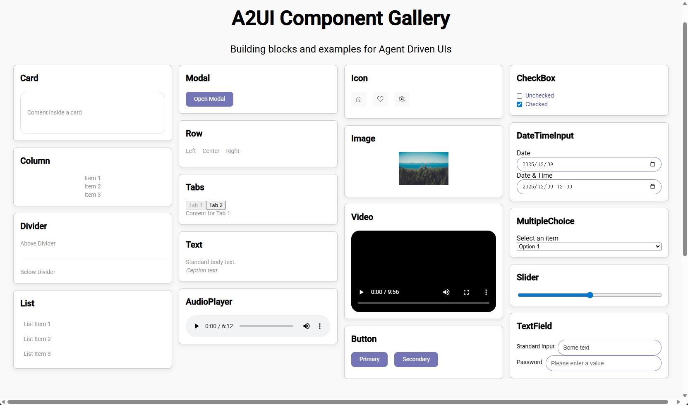
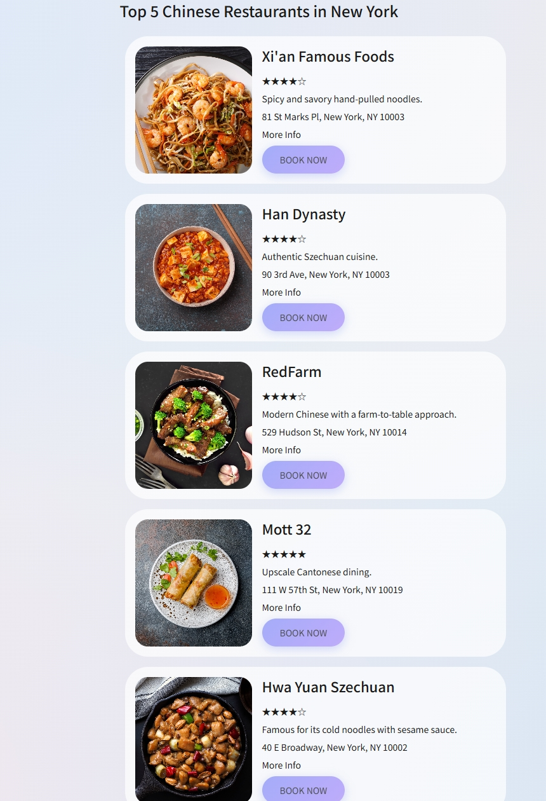

# a2ui-vue


[](https://a2ui.org/)
[](https://shawnwang15.github.io/a2ui-vue/en/)

> **a2ui-vue** is a community **Vue 3 renderer** for the [A2UI (Agent-to-UI) open protocol](https://a2ui.org/).  
> It enables AI agents to express UI intent as structured JSON and have it rendered as rich, interactive components inside any Vue 3 application — with no HTML/CSS knowledge required by the agent.

**[📖 Documentation](https://shawnwang15.github.io/a2ui-vue/en/)** · **[🌐 中文说明](README.zh-CN.md)**




## TL;DR

- Product: Vue 3 renderer for the A2UI (Agent-to-UI) protocol
- Input: structured A2UI JSON messages generated by AI agents or backend services
- Output: rich, interactive Vue user interfaces
- Best for: generative UI, agent UX, AI copilots, tool-driven workflows, structured frontend rendering
- Stack: Vue 3, TypeScript, Composition API, extensible component catalog
- Compatibility: v0.8 (Supported) | v0.9 (In Progress)

## Navigation

- [Why a2ui-vue?](#why-a2ui-vue)
- [What is A2UI?](#what-is-a2ui)
- [Installation](#installation)
- [Quick Start](#quick-start-3-lines)
- [Use Cases](#use-cases)
- [Documentation Map](#documentation-map)
- [FAQ](#faq)
- [Monorepo Structure](#monorepo-structure)
- [Available Scripts](#available-scripts)
- [Demo Applications](#demo-applications)

---

## Why a2ui-vue?

- Decouples agent logic from frontend implementation details
- Lets AI agents describe interface intent with structured JSON instead of raw HTML
- Gives Vue teams a native renderer with TypeScript, theming, and component reuse
- Makes agent-generated UI more deterministic, inspectable, and maintainable

## What is A2UI?

**A2UI (Agent-to-UI)** is an open protocol that defines how AI agents communicate UI intent to a frontend renderer. Instead of generating raw HTML/CSS, an agent emits typed JSON messages ("show a card with title X and a list of Y"). The renderer translates those messages into real visual components.

```
AI Agent  ──(A2UI JSON)──►  a2ui-vue Renderer  ──►  User Interface
```

**a2ui-vue** is the community Vue 3 implementation of this protocol:
- 20+ built-in components (layout, content, media, inputs)
- Composables: `provideA2UI`, `useMessageProcessor`, `useA2UIConfig`
- Extensible component Catalog & theme system
- Full TypeScript support, ESM + CJS dual build
- Compatible with Google's official Angular and Lit A2UI renderers

## Installation

```bash
npm install a2ui-vue
# or
pnpm add a2ui-vue
```

> **Requirements**: Vue 3.4+, Node.js 18+

## Quick Start (3 lines)

```vue
<!-- App.vue -->
<script setup lang="ts">
import { provideA2UI, DEFAULT_CATALOG } from 'a2ui-vue'
import 'a2ui-vue/dist/vue.css'

provideA2UI({ catalog: DEFAULT_CATALOG })
</script>
```

```vue
<!-- YourPage.vue -->
<script setup lang="ts">
import { useMessageProcessor, A2UIRenderer } from 'a2ui-vue'

const processor = useMessageProcessor()
// feed agent messages: processor.processMessage(msg)
</script>

<template>
  <A2UIRenderer :surfaces="processor.surfaces" />
</template>
```

## Use Cases

- AI chat applications that need structured cards, lists, forms, and media blocks
- Internal copilots that generate task-oriented workflow UIs from tool outputs
- Agent platforms that need a protocol-first generative UI renderer for Vue 3
- Systems that want consistent rendering across model providers and agent implementations

## Documentation Map

| Topic | Link |
|------|------|
| Introduction | [Docs: Introduction](https://shawnwang15.github.io/a2ui-vue/) |
| Quick Start | [Docs: Getting Started](https://shawnwang15.github.io/a2ui-vue/guide/getting-started.html) |
| Renderer Concepts | [Docs: Vue Renderer](https://shawnwang15.github.io/a2ui-vue/guide/vue-renderer.html) |
| Components | [Docs: Component Reference](https://shawnwang15.github.io/a2ui-vue/guide/components.html) |

## FAQ

### What is a2ui-vue?

a2ui-vue is a Vue 3 renderer for the A2UI open protocol. It turns structured JSON messages from AI agents into real, interactive Vue components.

### What is A2UI?

A2UI stands for Agent-to-UI. It is a protocol for describing UI intent in a structured, renderer-agnostic format.

### How is this different from generating HTML directly?

The agent produces structured UI data rather than raw markup. The renderer owns presentation, theming, and component behavior, which improves consistency and maintainability.

### Can I use this with any LLM or agent framework?

Yes. Any model or agent system that can produce A2UI-compliant JSON can work with a2ui-vue.

### Does it support custom components?

Yes. You can extend the default catalog and inject your own components through the configuration layer.

## Monorepo Structure

```
a2ui-vue/
├── packages/
│   ├── vue-renderer/       # a2ui-vue — Vue 3 renderer (main package)
│   └── web_core/           # @a2ui/web_core — protocol core & types
├── node-a2ui/
│   ├── agent_sdks/         # @a2ui/agent-sdks — Node.js agent toolkit
│   └── a2a_agents/         # Agent implementation samples
├── samples/
│   ├── agent/              # Server-side agent samples
│   │   ├── component_gallery/
│   │   ├── contact_lookup/
│   │   └── restaurant_finder/
│   └── client/             # Vue frontend client samples
│       ├── gallery/
│       ├── contact/
│       └── restaurant/
├── specification/          # A2UI protocol spec (v0.8 ~ v0.10)
└── docs/                   # VitePress documentation site
```

## Available Scripts

| Command | Description |
|---------|-------------|
| `pnpm run build:lib` | Build all library packages |
| `pnpm run build:doc` | Build the VitePress documentation site |
| `pnpm run dev:gallery` | Start Component Gallery demo (agent + client) |
| `pnpm run dev:contact` | Start Contact Lookup demo (agent + client) |
| `pnpm run dev:restaurant` | Start Restaurant Finder demo (agent + client) |

## Demo Applications

| Demo | Description |
|------|-------------|
| **Component Gallery** | Static showcase of all 20+ built-in components, no LLM required |
| **Contact Lookup** | AI agent queries contacts and returns card-based UI |
| **Restaurant Finder** | AI agent recommends restaurants with structured UI output |

## License

[MIT](LICENSE)
